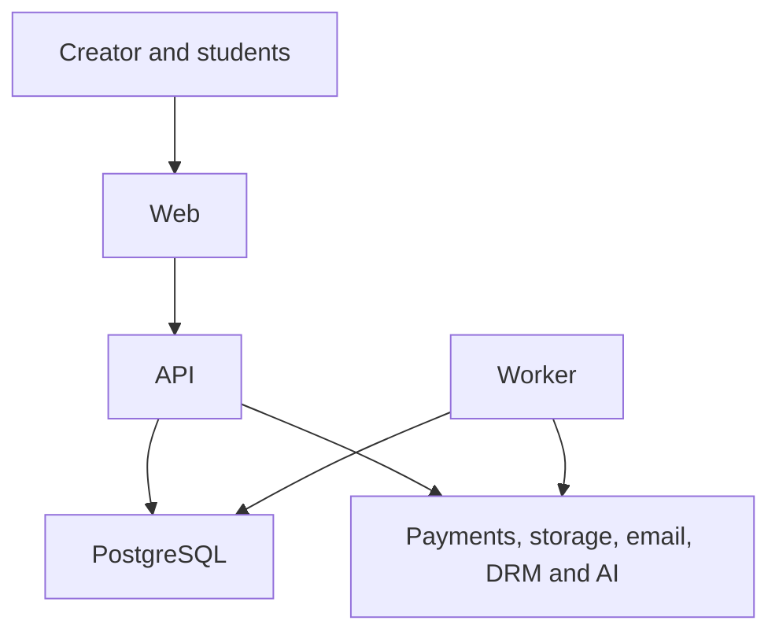
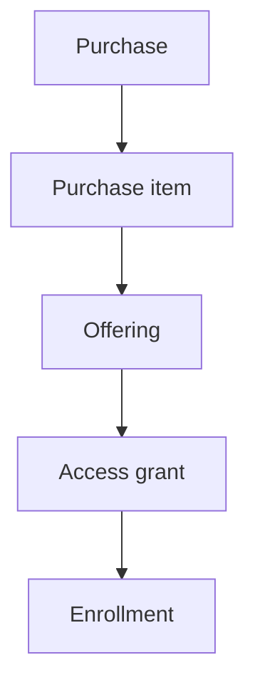
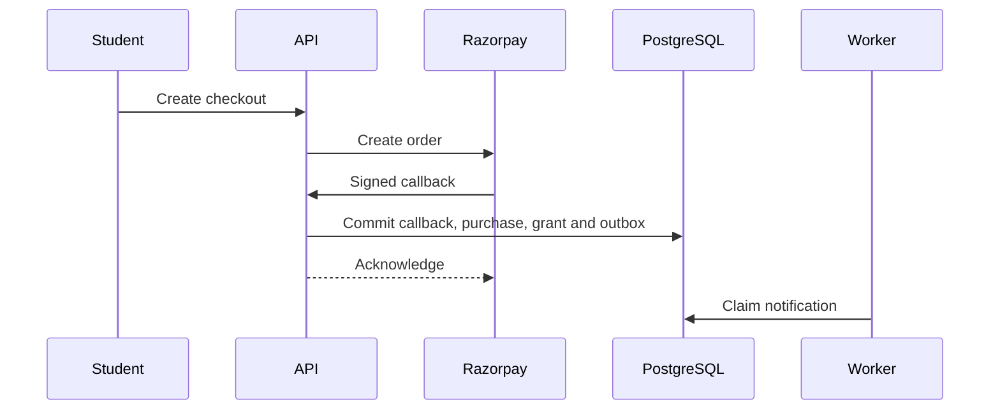
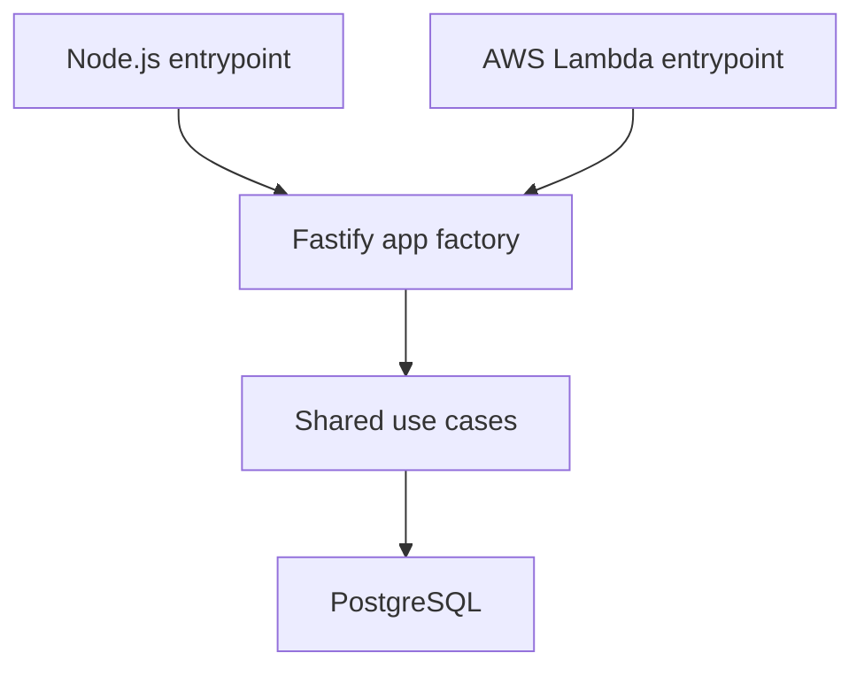
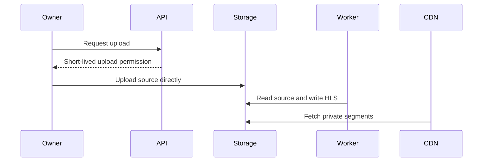

# VeoLMS architecture for developers

**Audience:** Full-stack developers and new contributors  
**Purpose:** Explain the V1 system in concrete language before presenting formal architecture details.

## The system in one minute

VeoLMS is one TypeScript codebase with three applications:

- **Web:** Student Portal, Student Dashboard, Learning Workspace, public academy pages, and Academy Admin Dashboard
- **API:** Authentication, permissions, courses, payments, access grants, progress, playback authorization, and provider callbacks
- **Worker:** Video processing, email, imports, exports, analytics rollups, retention, and other retryable background work

One Academy Runtime serves one creator. Its applications share one PostgreSQL database. Large files live in private S3-compatible storage and video streams through a CDN.



The Web, API, and Worker are separate processes, but they are not separate products or repositories.

## Interfaces people use

| Interface | Purpose |
| --- | --- |
| Student Portal | Complete public and authenticated student application |
| Student Dashboard | Signed-in student home with courses, progress, comments, and Q&A |
| Learning Workspace | Lecture content, video player, progress, notes, comments, and Q&A |
| Academy Admin Dashboard | Creator interface for content, commerce, students, moderation, analytics, and settings |

## Planned public repository

```text
apps/
  web/
  api/
    src/
      app.ts                    Host-neutral Fastify application
      entrypoints/
        node-server.ts          VPS, EC2, containers, local development
        aws-lambda.ts           API Gateway and Lambda adapter
  worker/
  installer/

packages/
  academy/
  identity/
  content/
  offerings/
  commerce/
  access/
  learning/
  assessment/
  media/
  community/
  notifications/
  analytics/
  migration/
  audit/
  ai/
  database/
  contracts/
  config/
  observability/
  testing/

infrastructure/
  compose/
  aws-lambda/

docs/
```

This is a pnpm workspace. Each domain package contains its business rules, use cases, interfaces, and adapters where appropriate.

## How a request moves through the code

An API request should follow this path:

```text
HTTP route → input validation → authentication → authorization
→ application use case → domain rules → database transaction
→ response or durable background job
```

Example: creating a manual access grant

1. The route validates the request.
2. Identity confirms the caller and recent authentication.
3. Authorization checks `access.grant` and the academy resource.
4. The Access module validates the Offering and requested validity.
5. One transaction creates the `AccessGrant`, relevant enrollment state, audit event, and outbox notification.
6. The API returns only after commit.
7. A worker sends the notification later and can retry without creating another grant.

Routes do not contain business rules, and UI visibility is never the authorization boundary.

## The modules developers will work in

| Module | Owns |
| --- | --- |
| Academy | Branding, homepage blocks, academy settings, and domain configuration |
| Identity | Users, login identities, sessions, owner MFA, roles, capabilities, and support grants |
| Content | Courses, sections, lectures, resources, publication, and revisions |
| Offerings | The generic resource that can be sold or granted; Course is the V1 type |
| Commerce | Prices, coupons, bundles, purchases, payments, refunds, invoices, and callback inbox |
| Access | `AccessGrant` validity, source, status, and revocation |
| Learning | Enrollment, progress, notes, bookmarks, completion, and certificates |
| Assessment | Quizzes, assignments, submissions, and passing conditions |
| Media | Uploads, assets, renditions, transcripts, video chapters, and playback policy |
| Community | Comments, Q&A, replies, reports, attachments, and moderation |
| Notifications | In-app notifications, email requests, templates, and preferences |
| Analytics | Product events and creator-facing aggregates |
| Migration | Canonical imports, source adapters, mapping, reconciliation, and run state |
| Audit | Privileged audit events, export, retention, and operational controls |
| AI | Provider configuration, approved data categories, and generated artifacts |

### Simple ownership rules

- A module may write only its own tables.
- Call another module through its application interface; do not import its repository.
- Use a durable internal event for work that can happen after commit.
- Domain code cannot import Fastify, Next.js, AWS SDKs, Razorpay SDKs, storage SDKs, or email SDKs.
- External providers are adapters behind interfaces owned by the module that needs them.
- V1 roles are simple, but use cases check named capabilities rather than permanent `if owner` rules.

## The commerce model

Payment and access are deliberately separate:



- **Offering:** What may be sold or granted. V1 implements courses.
- **Purchase:** What happened commercially.
- **AccessGrant:** Why a person is authorized to use an Offering.
- **Enrollment:** Course-specific learning and progress state.

A bundle purchase can create several access grants. A creator can create an access grant without inventing a payment. Revoking access does not delete progress.

## Reliable payment handling



The callback has a unique provider event identifier. Replaying it returns the stored outcome instead of creating duplicate business records. Email and analytics happen after the critical transaction through an outbox.

## One API, two hosting modes

There is no separate Lambda API codebase.



- The Node.js entrypoint handles port binding, shutdown, and health checks.
- The Lambda entrypoint translates API Gateway events and responses.
- Routes, schemas, authorization, errors, and use cases are identical.
- A conformance test suite runs against both hosts.
- Long-running work is saved as a durable job and handled by Worker.

The application normally connects to PostgreSQL over TCP, whether PostgreSQL is self-hosted or managed. A same-host Unix-domain socket is an optional deployment optimization, not a code assumption.

## Video path



At playback time, API verifies the session, lecture visibility, account state, and active access grant. It then issues short-lived CDN authorization. The browser fetches media from the CDN rather than sending video bytes through API.

Commercial DRM is an additional provider-backed protection layer. Signed HLS alone must never be labelled DRM.

## Background jobs

API writes a job or outbox record before returning success. Worker claims it with a lease, checkpoints long work, and retries idempotently.

Jobs include:

- Video probing, transcoding, packaging, and thumbnails
- Email and notification delivery
- Migration, export, retention, and deletion
- Analytics aggregation
- Transcript and summary generation

A Worker can run on ordinary EC2, Spot EC2, a VPS, or a container platform. Lambda does not start a machine or wait for a Worker.

## Adding a provider

For a new payment, storage, email, AI, video, or DRM provider:

1. Start from the provider-neutral port owned by the relevant module.
2. Implement an adapter in the infrastructure-facing package.
3. Normalize provider identifiers and errors at the adapter boundary.
4. Add provider contract tests using realistic callbacks and failures.
5. Keep credentials out of domain objects, logs, browser payloads, and exports.

Do not add provider-specific fields to unrelated domain tables merely because one SDK exposes them.

## What to test with a change

| Change | Minimum evidence |
| --- | --- |
| Domain rule | Unit tests for valid, invalid, and repeated operations |
| Database write | Constraints, transaction test, and migration test |
| API route | Contract, authentication, authorization, and error tests on Node and Lambda hosts |
| Payment callback | Signature, replay, reordering, and partial-failure tests |
| Worker handler | Retry, duplicate execution, lease expiry, and interruption tests |
| Provider adapter | Shared provider-contract suite |
| UI journey | Accessibility and end-to-end golden-path test |
| Privileged feature | Audit-event and threat-model test |

## What comes next

The [implementation roadmap](../delivery/implementation-roadmap-v1.md) starts with a thin end-to-end slice before filling every module. Formal constraints, deployment profiles, reliability targets, and remaining spikes are in the [technical architecture](technical-architecture.md).
