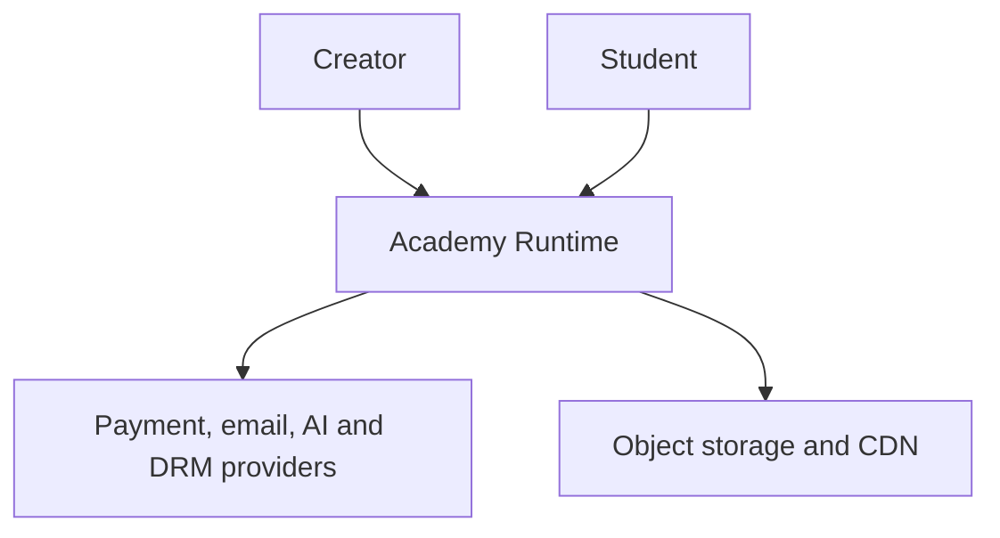
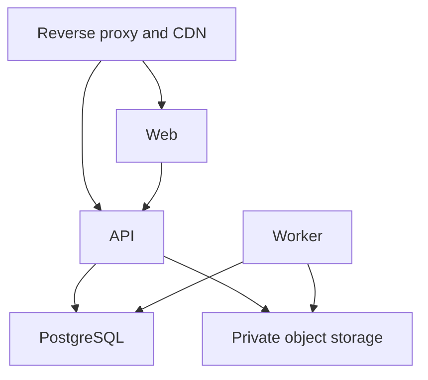
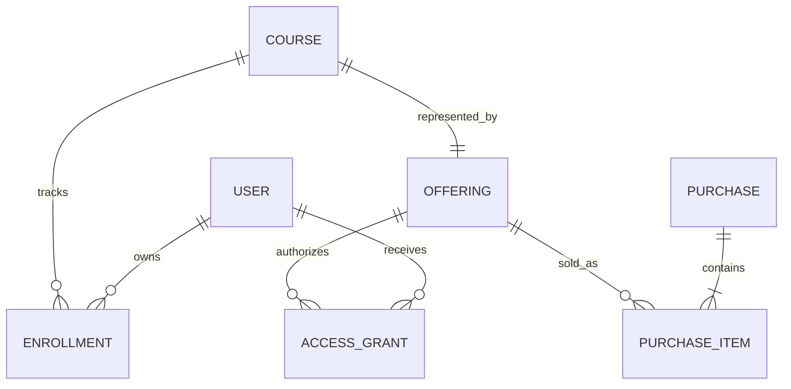
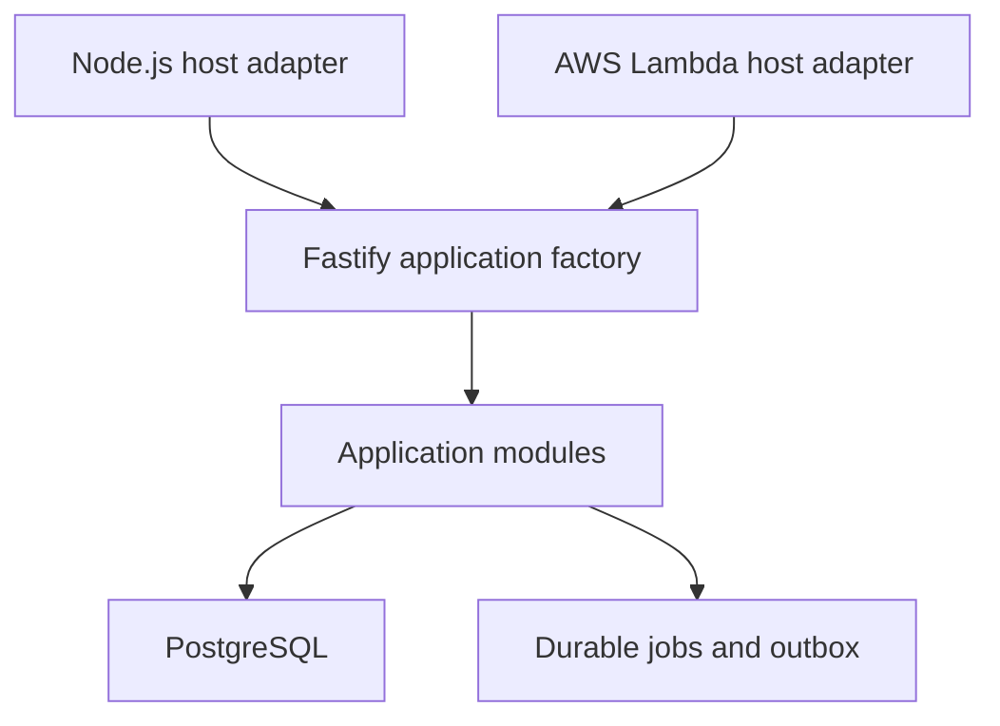
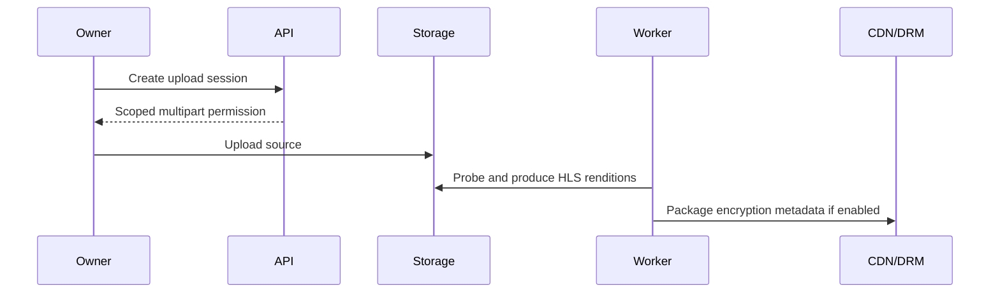

# VeoLMS V1 technical architecture

**Status:** Approved baseline with named implementation spikes
**Audience:** Maintainers, architects, security reviewers, and operators
**Product baseline:** [V1 PRD](../product/prd-v1.md)

This document describes the accepted system. Decision rationale is kept in [ADRs](adr/README.md), and a simpler introduction is available in [architecture for developers](architecture-for-developers.md).

## 1. Architecture outcome

VeoLMS Core is one public TypeScript modular-monolith repository producing four deployable artifacts:

1. **Web:** Next.js application containing public academy pages, Student Portal, Student Dashboard, Learning Workspace, and Academy Admin Dashboard.
2. **API:** One Fastify application exposed through a Node.js server entrypoint or an AWS Lambda entrypoint.
3. **Worker:** Durable background processing for video, notifications, migrations, exports, retention, and aggregates.
4. **Installer:** Preflight checks, configuration, deployment, migration, health verification, update, and recovery guidance.

One Academy Runtime serves one creator and uses one logical PostgreSQL database. Object storage holds large assets. A CDN delivers private adaptive video.

## 2. Architecture drivers

### Product constraints

- One creator and academy-local identity per Academy Runtime
- Purchase, access grant, and enrollment are separate
- Owner MFA cannot be bypassed by the selected primary login method
- Critical transactions are replay-safe and durable before acknowledgement
- Paid content authorization is enforced by API
- Support access is visible, expiring, scoped, and audited
- Creator data and assets remain exportable
- Core remains practical to self-host

### Quality targets

| Quality | Initial target |
| --- | --- |
| Web responsiveness | p75 LCP ≤ 2.5 s, INP ≤ 200 ms, CLS ≤ 0.1 |
| Video startup | p75 ≤ 2 s broadband and ≤ 4 s constrained mobile |
| Rebuffering | Below 0.5% broadband and 2% constrained mobile in measured pilot |
| Production availability | Approximately 99.93% over six months when using the recommended high-availability profile |
| Catastrophic recovery | Restore within 24 hours |
| Ordinary failure durability | No loss of acknowledged critical transactions across process, host, or availability-zone failure |
| Initial aggregate load | 100 academies, 100,000 registered students, 10,000 concurrent students, 1,000 purchases/day |

Targets are validated with real-user and failure-test data and revised through an ADR when evidence demands it.

## 3. System context and trust boundaries



Trust boundaries:

1. **Internet to edge:** TLS, request-size limits, coarse throttling, bot protection, and safe proxy headers.
2. **Browser to Web/API:** Secure cookies, CSRF protection, content security policy, input validation, and server-side authorization.
3. **API/Worker to PostgreSQL:** Least-privilege database identity, encrypted transport when crossing hosts, transactions, and constraints.
4. **Runtime to providers:** Academy-scoped secrets, callback authentication, timeouts, retries, redaction, and egress policy.
5. **Runtime to media:** Private origin, limited credentials, short-lived playback authorization, and optional DRM licence flow.

## 4. Runtime containers



| Container | Responsibilities | Scaling |
| --- | --- | --- |
| Edge | TLS, routing, compression, static caching, request limits, and security headers | Per deployment |
| Web | Public rendering, authenticated UI, PWA shell, and browser telemetry | Independent replicas |
| API | REST contracts, sessions, authorization, transactions, callbacks, and playback authorization | Lambda invocations or Node.js replicas |
| Worker | Leased jobs, outbox delivery, video, email, migration, export, retention, and rollups | Queue demand |
| PostgreSQL | Transactional source of truth, jobs/outbox, audit metadata, full-text search, and V1 aggregates | One logical database per academy |
| Object storage | Sources, HLS, attachments, resources, documents, and exports | Academy-scoped namespace |
| Redis/Valkey | Optional shared cache and distributed limiter | Optional for small Core; recommended for multiple replicas |

The browser never receives database credentials, provider secrets, raw DRM keys, or object-storage credentials beyond short-lived, scope-limited operations.

## 5. Academy isolation

- One deployment configuration represents one academy.
- Ordinary domain tables do not contain a multi-tenant `tenant_id` selector.
- One logical PostgreSQL database and role belong to the academy.
- Storage, signing keys, and provider credentials are academy-scoped.

## 6. Module architecture

Domain ownership is defined in the [developer architecture](architecture-for-developers.md#the-modules-developers-will-work-in). The enforced dependency direction is:

```text
entrypoints and UI
        ↓
application use cases
        ↓
domain rules and domain-owned ports
        ↑
provider and persistence adapters
```

Rules:

- A module writes only its own schema objects.
- Cross-module commands use an application interface.
- Post-commit reactions use internal events recorded in the transactional outbox.
- Domain packages do not import web, database-driver, queue, infrastructure-provider, or external-service SDKs.
- Framework wiring is confined to composition roots and entrypoints.
- Architecture tests reject prohibited package imports.
- Internal events and module interfaces are not public extension contracts until intentionally versioned and documented.

## 7. Core information model



Rules:

- `Offering` represents a grantable or sellable resource. Course is the only V1 Offering type.
- `AccessGrant` authorizes a recipient for a time range or indefinitely and records its source.
- `Purchase` and `PurchaseItem` record commerce but do not directly authorize use.
- `Enrollment` stores course-learning state and survives ordinary grant renewal or replacement.
- Bundles can create several access grants from one purchase.
- Manual and migrated grants do not create fake payment records.
- Database constraints enforce provider-event uniqueness and critical one-per-source relationships.

## 8. Transactions, callbacks, and jobs

### Critical transaction

A single business operation commits its payment state, purchase, access-grant change, enrollment state, refund state, audit event, and outbox messages in one PostgreSQL transaction where applicable. API reports success only after commit.

### Provider callback inbox

1. Capture callback raw bytes under strict size limits.
2. Authenticate the provider signature before applying state.
3. Insert a callback-inbox row with a unique provider event key.
4. Apply an allowed state transition in a transaction.
5. Record the resulting business identifiers and stable response.

Replay returns the stored result. Reordering, delayed callbacks, and repeated refunds are covered by state-machine tests.

### Transactional outbox and durable jobs

- Business state and outbox records commit together.
- Worker claims work using a lease and idempotency key.
- Long jobs persist checkpoints.
- Retry policy uses bounded backoff and classified errors.
- Poison jobs enter a dead-letter state and alert an operator.
- Optional provider queues may wake workers, but PostgreSQL remains authoritative in V1.

## 9. Portable API hosting



- `app.ts` owns route registration, schemas, policies, error mapping, and dependency wiring.
- Node entrypoint owns port binding, signals, health endpoints, and graceful shutdown.
- Lambda entrypoint owns API Gateway translation, lifecycle integration, and warm initialization reuse.
- AWS SDKs and AWS event types are restricted to AWS adapters.
- Correctness never depends on process-local state, writable local disk, or a worker completing during a request.
- Both hosts emit the same OpenAPI document and pass the same conformance, authorization, callback, and failure suites.
- Lambda concurrency and database connections are capped; a provider connection proxy is a deployment adapter, not a domain dependency.

## 10. Identity and authorization

Primary authentication is behind a VeoLMS-owned identity interface. Better Auth is the leading implementation candidate and must pass a security spike.

Owner state transition:

```text
primary identity verified
→ owner account identified
→ TOTP or recovery code verified
→ owner-capable session issued
```

No Google, email-link, passwordless, or recovery path may skip the owner MFA gate. High-risk operations require recent step-up authentication.

API use cases declare capabilities such as `course.publish`, `payment.refund`, `access.grant`, `comment.moderate`, and `data.export`. Fixed V1 roles map to capabilities; future creator-defined roles use the same catalogue. Resource policies also verify academy, ownership, publication state, and active access grant.

Support uses an explicit `SupportGrant` containing academy, support actor, reason, approved scope, grantor, start, expiry, and revocation. Interface access displays a banner and cannot outlive the grant.

## 11. Video architecture

### Ingestion



Worker validates media metadata, quarantines untrusted input, generates a source-aware bitrate ladder, writes HLS manifests and segments, creates thumbnails, and records restartable state.

### Playback

API verifies session, lecture visibility, account state, and active access grant. It issues a short-lived CDN token or cookie covering the required paths. The player requests manifests and segments from CDN.

Commercial DRM additionally requires encrypted packaging, key management, a licence server, browser EME support, a compatible player, and systems such as Widevine, FairPlay, or PlayReady. A provider adapter keeps raw content keys outside ordinary API payloads, logs, and database records.

## 12. Provider and future-feature boundaries

Domain-owned ports cover at least:

| Port | Initial adapter or direction |
| --- | --- |
| Payment | Razorpay |
| Object storage | S3-compatible API |
| CDN authorization | Signed URL, token, or cookie adapter |
| Email | SMTP or selected transactional provider |
| Video processing | FFmpeg Worker; optional managed transcoder |
| DRM | Selected external multi-DRM provider |
| AI | Redacted request and provider-key adapter |
| Telemetry | OpenTelemetry-compatible signals |

V1 establishes provider seams but does not publish a general third-party plugin runtime.

## 13. Data, search, analytics, and cache

- PostgreSQL is the source of truth for transactional data, sessions, jobs, callback inbox, outbox, audit metadata, transcript/catalogue full-text search, and basic V1 aggregates.
- Kysely provides typed queries. Schema changes use explicit reviewed SQL.
- Expand-and-contract migrations preserve an application rollback window.
- PostgreSQL may be self-hosted or managed through the same application configuration.
- TCP is the portable database transport. Unix-domain sockets are an optional same-host configuration.
- Analytics events are append-only and workers build bounded daily aggregates.
- Search indexes, aggregates, transcripts, and summaries are derived and rebuildable.
- CDN caches immutable assets and video segments. Personalized pages are never publicly cached.
- Redis/Valkey is optional until multiple replicas need shared cache, rate limits, or coordination.

## 14. Security architecture

Required controls include:

- Deny-by-default capability and resource checks
- Secure, HttpOnly, SameSite cookies and CSRF defenses
- Hashed, single-use, short-lived verification tokens
- Memory-hard password hashing
- Authentication and interaction throttling
- Strict callback verification and replay protection
- Private storage and blocked public origins
- Attachment allowlists, content inspection, and malware-scanner adapter
- Safe Markdown/rich-text rendering and Content Security Policy
- Secret encryption, rotation, and redaction
- Append-only privileged audit events with a separately protected off-runtime copy
- Dependency, container, licence, and secret scanning in CI
- Restore, authorization, and payment-replay tests as release gates

Detailed misuse cases and verification evidence are in the [threat model](../security/threat-model.md).

## 15. Reliability, recovery, and deletion

- Highly available production deployments use multiple failure domains, synchronous durable database commit, continuous WAL archiving, point-in-time recovery, encrypted backups, and restore drills.
- Critical assets use object versioning or equivalent protection.
- Graceful shutdown stops new claims and lets in-flight work complete or safely expire.
- Deployment health checks support rolling release and automatic rollback.
- Cross-region copies or replication have a measured near-zero RPO; strict regional RPO zero is not claimed.
- Deletion first records `deleted_at` and `purge_after`. Normal queries exclude deleted rows.
- Purge jobs verify retention class, legal hold, relationships, backups, and audit requirements.

Self-managed PostgreSQL is supported but is an ongoing operational responsibility: patching, monitoring, backup/PITR, capacity, vacuum health, upgrades, restoration tests, and optional replication. ProCodrr should separate database and application hosts before relying on the deployment for high availability.

## 16. Observability

Each request and job receives a correlation identifier. Structured logs, metrics, and traces use an OpenTelemetry-compatible model.

Minimum signals:

- Request rate, latency, errors, saturation, and host type
- Database connections, slow queries, locks, replication, storage, and backup status
- Job age, attempts, lease expiry, failure class, and dead-letter count
- Payment callback authentication, replay, transition, and reconciliation status
- Playback authorization, startup, buffering, rendition, and fatal errors
- Authentication failure, MFA recovery, authorization denial, support use, and privileged changes
- Deployment version and migration compatibility

Logs exclude authentication codes, session tokens, provider secrets, payment credentials, raw DRM keys, and unnecessary personal data.

## 17. Deployment profiles

| Profile | Components |
| --- | --- |
| Local development | Web, API, Worker, PostgreSQL, mail catcher, development S3-compatible storage, fake payment/DRM adapters, deterministic media |
| Simple Core | Reverse proxy, Web, API, Worker, PostgreSQL, creator-supplied storage/domain/email/Razorpay/optional DRM via Docker Compose |
| Advanced Core | External PostgreSQL, replicated applications, optional Redis/Valkey, selected storage/CDN/providers, secret manager and monitoring |
| Serverless API | Same Fastify app in Lambda/API Gateway; Web and Worker deploy independently; PostgreSQL jobs remain authoritative |

## 18. Technology baseline

| Concern | Baseline | Status |
| --- | --- | --- |
| Language | TypeScript 7.0.x native compiler | Accepted; exact version pinned at scaffold |
| Runtime | Node.js 24 LTS | Accepted |
| Package management | pnpm workspaces | Accepted |
| Web/PWA | Next.js 16 App Router | Accepted |
| API | Fastify 5 | Accepted |
| Database | PostgreSQL 18 default; PostgreSQL 16 supported floor | Accepted baseline |
| Data access | Kysely and reviewed SQL migrations | Accepted |
| Identity | Better Auth behind VeoLMS identity boundary | Spike required |
| API contract | Versioned REST JSON and OpenAPI | Accepted baseline |
| Jobs | PostgreSQL-backed durable jobs and transactional outbox | Spike required |
| Media | FFmpeg, HLS, signed CDN authorization | Accepted direction |
| DRM | External multi-DRM adapter | Provider spike required |
| Observability | OpenTelemetry-compatible logs, metrics, and traces | Accepted direction |
| Deployment | OCI containers, Docker Compose, and thin AWS Lambda API adapter | Accepted |
| Infrastructure providers | Platform-neutral application; measured reference deployments | Accepted |

TypeScript 7 is the stable Go-based native compiler. It does not currently expose the stable programmatic compiler API expected in 7.1; tooling that requires that API may temporarily use the official TypeScript 6 compatibility package without changing VeoLMS's primary compiler.

## 19. Required implementation spikes

1. Prove identical contracts, acceptable cold starts, packaging, and database connection budgets on Node.js and AWS Lambda.
2. Verify the selected lint, test, Next.js, declarations, editor, and code-generation toolchain with TypeScript 7.
3. Prove Better Auth integration cannot bypass VeoLMS owner MFA through any login or recovery path.
4. Measure PostgreSQL job leases, wake-up latency, retries, dead-letter behavior, and Spot interruption recovery.
5. Select a DRM provider using browser/device coverage, self-hosting fit, security, operations, and cost.
6. Compare representative self-hosting profiles for cost, request latency, video performance, transcoding, recovery, and operator effort.
7. Review the AGPL licence and contributor agreement strategy with qualified legal counsel before accepting substantive external contributions.

## 20. Primary technical references

- [TypeScript 7 announcement](https://devblogs.microsoft.com/typescript/announcing-typescript-7-0/)
- [Node.js release status](https://nodejs.org/en/about/previous-releases)
- [Next.js self-hosting](https://nextjs.org/docs/app/guides/self-hosting)
- [Fastify serverless guide](https://fastify.dev/docs/latest/Guides/Serverless/)
- [PostgreSQL current documentation](https://www.postgresql.org/docs/current/)
- [Kysely documentation](https://kysely.dev/docs/intro)
- [pnpm workspaces](https://pnpm.io/workspaces)
- [GNU AGPL version 3](https://www.gnu.org/licenses/agpl-3.0.en.html)
